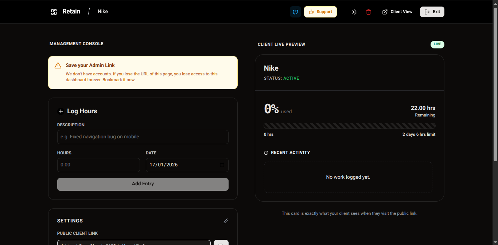

# Retain (Frontend)

A modern, real-time client retainer dashboard. Built to replace messy email threads and spreadsheets with a single, secure link.



##  Features

- **Zero-Login Access:** Clients access their dashboard via a unique, secure slug.
- **Real-Time Updates:** Socket.io integration pushes changes instantly (no refresh needed).
- **Budget Tracking:** Visual progress bar showing budget usage vs. remaining hours.
- **Work History:** Clear timeline of logs, descriptions, and hours spent.
- **Admin Controls:** Hidden admin interface to log hours, update status, and edit project details.
- **Dark/Light Mode:** Fully responsive UI with theme persistence.
- **"Refill" CTA:** Optional payment link that appears when the budget runs low.

##  Tech Stack

- **Framework:** [React](https://react.dev/) + [Vite](https://vitejs.dev/)
- **State Management:** [TanStack Query](https://tanstack.com/query/latest) (Server State) + [Zustand](https://github.com/pmndrs/zustand) (Client State)
- **Styling:** CSS Modules (Scoped styles) + [Lucide React](https://lucide.dev/) (Icons)
- **Real-Time:** [Socket.io Client](https://socket.io/)
- **Utilities:** `date-fns` (Formatting), `clsx` (Class merging)

##  Getting Started

### Prerequisites

- Node.js (v18+)
- The backend server running locally or deployed.

### Installation

1. **Clone the repository**
   ```bash
   git clone [https://github.com/yourusername/retain-frontend.git](https://github.com/yourusername/retain-frontend.git)
   cd retain-frontend
   ```
